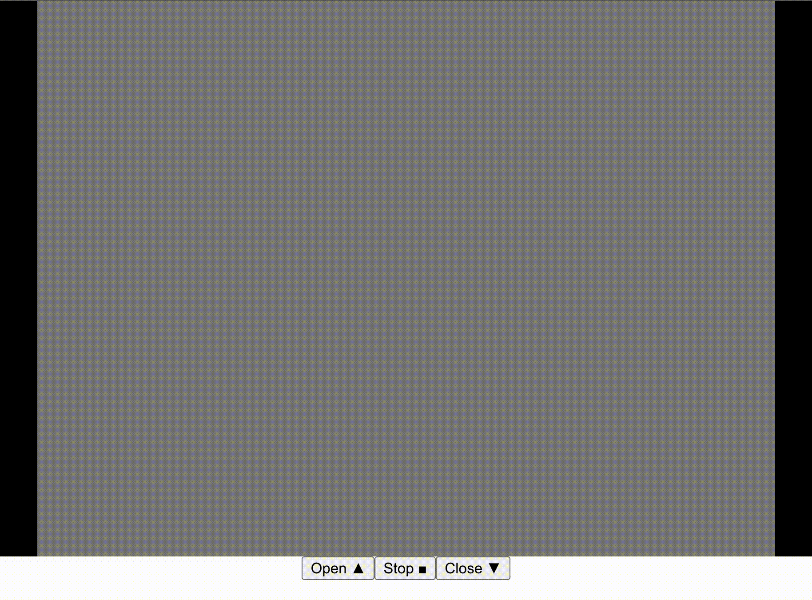

# Garage Door

An example of garage door built with React


## Demo



The running example is here: [garagedoor](https://cjz25.github.io/garagedoor)


## Table of contents
1. [Requirements](#requirements)
2. [Installation](#installation)
3. [Usage](#usage)
4. [License](#license)


## Requirements

  * npm 8.13.2
  * node v18.5.0
  * React 18.2.0


## Installation

### Install from the source:

```sh
$ git clone https://github.com/cjz25/GarageDoor.git
```

### Install the dependencies:

```sh
$ npm install
```


## Usage

In the project directory, you can run:

### `npm start`

Runs the app in the development mode.\
Open [http://localhost:3000](http://localhost:3000) to view it in your browser.

The page will reload when you make changes.\
You may also see any lint errors in the console.

### `npm run build`

Builds the app for production to the `build` folder.\
It correctly bundles React in production mode and optimizes the build for the best performance.

The build is minified and the filenames include the hashes.\
Your app is ready to be deployed!

See the section about [deployment](https://facebook.github.io/create-react-app/docs/deployment) for more information.


## License
MIT License